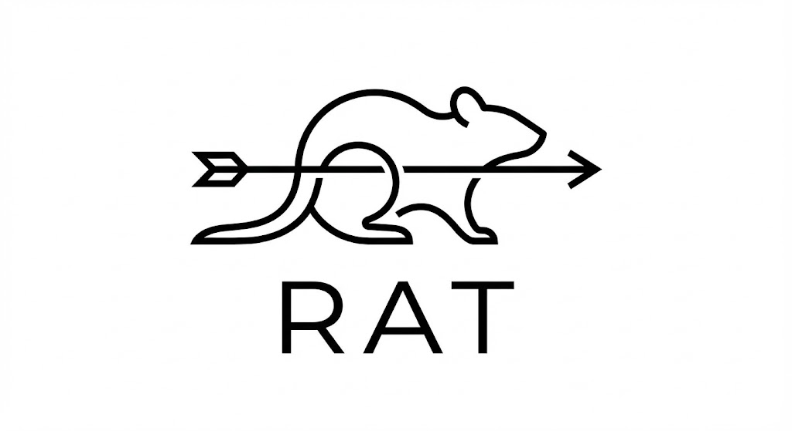

# RAT — Rotational/Angular Tracking

**RAT** is an automated behavioral scoring tool for lab mice, designed to replace hours of manual tracking. It uses **DeepLabCut's pre-trained SuperAnimal models** to automatically track mouse keypoints (nose, ears, tail) and classify behaviors like "Sniffing" vs. "Roaming" relative to stimulus zones.



## Features

- **No Training Required**: Uses the pre-trained `SuperAnimal-TopViewMouse` model (trained on 5,000+ lab mice).
- **Interactive Calibration**: Simply draw the experimental arena on the video frame.
- **4-Zone Detection**: Automatically divides arena into Top Stimulus, Adjacent to Top, Adjacent to Bottom, and Bottom Stimulus zones.
- **Automated Scoring**:
  - **Sniffing**: Nose near zone edge + mouse stationary.
  - **Head Direction**: Tracks if mouse is facing Top, Bottom, or Middle.
  - **Grooming**: Detects when mouse curls up (nose close to tail).
- **Debug Preview**: View real-time tracking overlays before processing.
- **Data Export**: Outputs timestamped `.csv` files ready for statistical analysis.

---

## Installation

### Option 1: GUI Installer (Recommended)

Double-click `installer.py` — a visual installer will guide you through:
1. Installing Miniconda (if needed)
2. Creating the RAT environment
3. Downloading the tracking model

**Requirements**: Python 3.8+ must be installed to run the installer.

### Option 2: Manual Installation

```bash
# Create environment
conda create -n rat python=3.10 -y
conda activate rat

# Install dependencies
pip install deeplabcut deeplabcut-live customtkinter opencv-python pandas pillow numpy

# Download model (happens automatically on first run)
python -c "from dlclive import DLCLive; DLCLive('superanimal_topviewmouse')"
```

---

## Running RAT

```bash
conda activate rat
python main.py
```

Or after using the GUI installer, click **Launch RAT**.

---

## Usage Guide

### 1. Load Video
Click **Select Video** and choose your `.mp4`, `.avi`, or `.mts` file.

### 2. Set Output
Click **Set Output Folder** to choose where results will be saved.

### 3. Calibrate Arena
Click **Draw Arena** and drag a rectangle around the experimental arena. The system automatically divides it into 4 equal zones.

### 4. Debug Preview (Optional)
Use the **Preview** controls to verify tracking:
- **▶ Preview**: Play video with tracking overlays
- **⏭**: Step forward one frame
- **⏹**: Stop preview

The preview shows:
- Green dot = Nose
- Yellow dots = Ears
- Red dot = Tail base
- White arrow = Body direction
- Colored zones = Detection regions
- State label = Current behavior classification

### 5. Process
Click **Start Processing** to analyze the full video. Results are saved as CSV.

---

## Output Data

The generated `video_name_results.csv` contains:

| Column | Description |
|--------|-------------|
| `Frame` | Video frame number |
| `Time_s` | Timestamp in seconds |
| `Location` | Zone where mouse is located |
| `Attention` | Behavioral state (Sniffing Top, Head Bottom, etc.) |
| `Nose_X`, `Nose_Y` | Raw nose coordinates |
| `Head_Angle` | Body orientation angle |

---

## Developer Info

- **Architecture**: See `VISION.md` for technical details.
- **Vision Engine**: `tracker.py` — DeepLabCut-Live wrapper
- **Logic Core**: `classifier.py` — Behavioral state machine
- **GUI**: `main.py` — CustomTkinter interface
- **Installer**: `installer.py` — Cross-platform setup wizard
